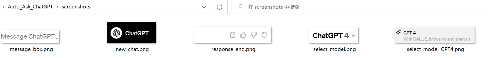
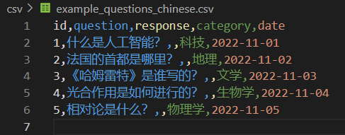
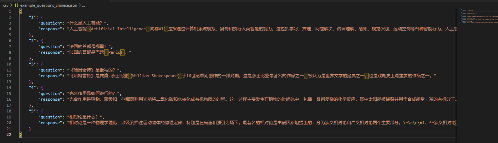

# AUTO_ASK_ChatGPT 工具

## 项目简介
AUTO_ASK_ChatGPT 是一个自动化工具，旨在简化与 OpenAI 的 ChatGPT 进行交互的过程。它能自动从 CSV 文件中读取问题，将问题粘贴到 ChatGPT 的对话框中，并收集回答，最后将这些回答存储到 JSON 文件中。此工具使用 Python 语言编写，并利用了 pyautogui 库来模拟用户的屏幕交互。

## 安装指南
要使用此工具，您需要：

- 推荐Python 3.9 或更高版本。
- pyautogui 和其他依赖库的安装。
- OpenAI ChatGPT 网页的截图，存放在项目的 `screenshots` 文件夹中。

安装 Python 依赖：
```bash
pip install pyautogui pandas pyperclip
```

## 使用说明
0. **打开网页**：在浏览器中打开chat.openai.com并登录账号（如果要指定模型，请手动在ChatGPT网页中选择ChatGPT 3.5/4）。

1. **准备截图**：首先，您需要在 `screenshots` 文件夹中存放 OpenAI ChatGPT 网页元素的截图，例如对话框、发送按钮等。（由于浏览器、屏幕分辨率等问题，所以请参照文件夹中原始的截图样例自行重新截图并逐个替换）

2. **准备 CSV 文件**：在 `csv` 文件夹中放置您的问题列表。每个问题应该是 CSV 文件中的一行。


3. **运行工具**：使用以下命令运行工具：
   ```bash
   python csv_chat.py
   ```
   - 运行过程
      
   - 运行结果
      


## 文件结构
- `chat_interaction.py`：包含与 ChatGPT 网页交互的主要功能。
- `csv_chat.py`：从 CSV 文件读取问题，并使用 `chat_interaction.py` 与 ChatGPT 进行交互。
- `screenshots/`：存放 ChatGPT 网页元素的截图。
- `csv/`：存放问题的 CSV 文件。
- `readme_pic/`：存放readme中的图片、gif

## 注意事项
- 确保在运行工具之前已经打开了 ChatGPT 的网页，并登录了您的账户。
- 工具的准确性高度依赖于截图的质量和屏幕分辨率。可能需要根据您的屏幕设置调整截图。
- 请确保在运行工具期间，ChatGPT 网页保持在前台。
- 使用此工具时，请遵守 OpenAI 的使用条款和条件。
